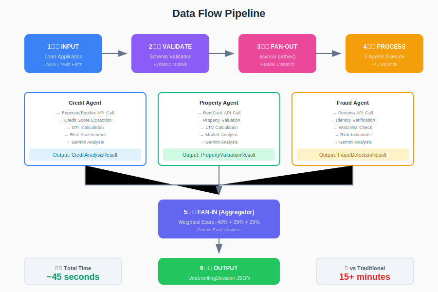
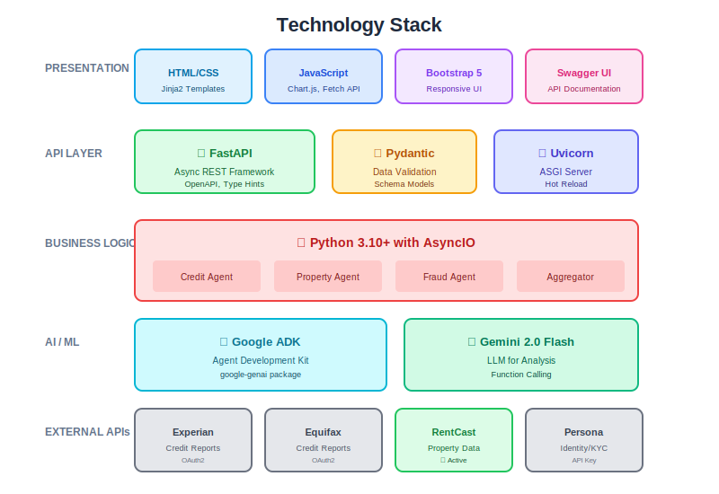
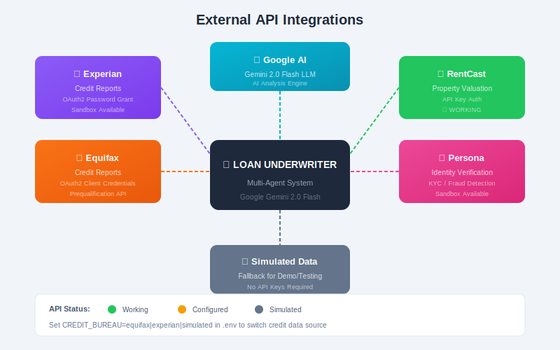

# 📚 Loan Underwriter - Project Documentation

> **Comprehensive technical documentation for the AI Multi-Agent Loan Underwriting System**

---

## Table of Contents

1. [Project Overview](#1-project-overview)
2. [Architecture](#2-architecture)
3. [Technology Stack](#3-technology-stack)
4. [Installation & Setup](#4-installation--setup)
5. [Configuration](#5-configuration)
6. [API Reference](#6-api-reference)
7. [Agent Details](#7-agent-details)
8. [Data Models](#8-data-models)
9. [External API Integrations](#9-external-api-integrations)
10. [Security](#10-security)
11. [Performance](#11-performance)
12. [Troubleshooting](#12-troubleshooting)

---

## 1. Project Overview

### 1.1 What is This?

The **Loan Underwriter** is a production-ready AI multi-agent system that processes mortgage loan applications using a **Fan-Out/Fan-In** architecture. It demonstrates how modern AI can reduce loan underwriting time from **15+ minutes to ~45 seconds** - a 20x improvement.

### 1.2 Key Features

| Feature | Description |
|---------|-------------|
| **Parallel Processing** | 3 specialized agents execute simultaneously using Python's `asyncio` |
| **Google Gemini AI** | Powered by Gemini 2.0 Flash for intelligent risk analysis |
| **Real API Integration** | Connects to Experian, Equifax, RentCast, and Persona APIs |
| **Web Interface** | Beautiful Bootstrap 5 dashboard with real-time results |
| **REST API** | Full OpenAPI documentation with Swagger UI |
| **Extensible** | Easy to add new agents or API integrations |

### 1.3 Use Cases

- **Mortgage Pre-Qualification**: Rapid assessment for home loan applicants
- **Risk Assessment**: Multi-dimensional analysis (credit, property, fraud)
- **Demo/POC**: Showcase AI capabilities in financial services
- **Learning**: Example of fan-out/fan-in agent architecture

---

## 2. Architecture

### 2.1 High-Level Architecture


The system uses a **Fan-Out/Fan-In** pattern:

```
┌─────────────────────────────────────────────────────────────────┐
│                     LOAN APPLICATION INPUT                       │
└─────────────────────────────────┬───────────────────────────────┘
                                  │
                                  ▼
┌─────────────────────────────────────────────────────────────────┐
│                    FAN-OUT (asyncio.gather)                      │
│              Dispatches to 3 agents in parallel                  │
└──────────┬──────────────────────┬───────────────────┬───────────┘
           │                      │                   │
           ▼                      ▼                   ▼
    ┌─────────────┐       ┌─────────────┐      ┌─────────────┐
    │   CREDIT    │       │  PROPERTY   │      │   FRAUD     │
    │   AGENT     │       │   AGENT     │      │   AGENT     │
    │             │       │             │      │             │
    │ Weight: 40% │       │ Weight: 35% │      │ Weight: 25% │
    └──────┬──────┘       └──────┬──────┘      └──────┬──────┘
           │                     │                    │
           └─────────────────────┼────────────────────┘
                                 │
                                 ▼
┌─────────────────────────────────────────────────────────────────┐
│                    FAN-IN (Aggregator Agent)                     │
│            Combines results using weighted formula               │
└─────────────────────────────────┬───────────────────────────────┘
                                  │
                                  ▼
┌─────────────────────────────────────────────────────────────────┐
│                    UNDERWRITING DECISION                         │
│             APPROVE | MANUAL_REVIEW | DENY                       │
└─────────────────────────────────────────────────────────────────┘
```

### 2.2 Data Flow



### 2.3 Component Diagram

```
loan_underwriter/
├── app.py              # FastAPI application factory
├── config.py           # Environment configuration
├── models.py           # Pydantic data models
│
├── agents/
│   ├── base_agent.py       # Abstract base class
│   ├── credit_agent.py     # Credit analysis (Experian/Equifax)
│   ├── property_agent.py   # Property valuation (RentCast)
│   ├── fraud_agent.py      # Fraud detection (Persona)
│   └── aggregator_agent.py # Result aggregation
│
├── api/
│   ├── routes.py       # API endpoint definitions
│   ├── schemas.py      # Request/Response schemas
│   └── views.py        # HTML view handlers
│
├── templates/          # Jinja2 HTML templates
└── static/             # CSS, JS, images
```

---

## 3. Technology Stack

### 3.1 Stack Overview



### 3.2 Core Technologies

| Layer | Technology | Purpose |
|-------|------------|---------|
| **Runtime** | Python 3.10+ | Async/await, type hints |
| **Web Framework** | FastAPI | High-performance REST API |
| **Server** | Uvicorn | ASGI server with hot reload |
| **AI Engine** | Google ADK + Gemini 2.0 | LLM-powered analysis |
| **Validation** | Pydantic v2 | Data models & validation |
| **HTTP Client** | httpx | Async HTTP requests |
| **UI** | Bootstrap 5 + Jinja2 | Responsive web interface |

### 3.3 External APIs

| API | Provider | Purpose | Auth Method |
|-----|----------|---------|-------------|
| Credit Reports | Experian | Credit scores, history | OAuth2 Password |
| Credit Reports | Equifax | Alternative credit data | OAuth2 Client Credentials |
| Property Data | RentCast | Property valuations | API Key |
| Identity | Persona | KYC, fraud detection | API Key |

---

## 4. Installation & Setup

### 4.1 Prerequisites

- Python 3.10 or higher
- pip package manager
- Google AI API key (free)

### 4.2 Quick Start

```bash
# 1. Clone repository
git clone <repository-url>
cd "FAN out-FAN in"

# 2. Create virtual environment
python -m venv venv
venv\Scripts\activate  # Windows
# source venv/bin/activate  # Linux/Mac

# 3. Install dependencies
pip install -r requirements.txt

# 4. Configure environment
copy .env.example .env
# Edit .env and add your GOOGLE_API_KEY

# 5. Run the application
python main.py
```

### 4.3 Access Points

| Endpoint | URL | Description |
|----------|-----|-------------|
| Web UI | http://127.0.0.1:8000 | Main dashboard |
| API Docs | http://127.0.0.1:8000/docs | Swagger UI |
| ReDoc | http://127.0.0.1:8000/redoc | Alternative docs |
| Health | http://127.0.0.1:8000/health | Health check |

---

## 5. Configuration

### 5.1 Environment Variables

All configuration is done via the `.env` file:

```env
# Required
GOOGLE_API_KEY=AIzaSy...              # Google AI Studio API key

# Credit Bureau Selection
CREDIT_BUREAU=simulated               # Options: equifax, experian, simulated

# Experian API (optional)
EXPERIAN_CLIENT_ID=xxx
EXPERIAN_CLIENT_SECRET=xxx
EXPERIAN_USERNAME=xxx
EXPERIAN_PASSWORD=xxx
EXPERIAN_ENV=sandbox

# Equifax API (optional)
EQUIFAX_CLIENT_ID=xxx
EQUIFAX_CLIENT_SECRET=xxx
EQUIFAX_ENV=sandbox
EQUIFAX_MEMBER_NUMBER=xxx

# Property API
RENTCAST_API_KEY=xxx                  # RentCast API key

# Fraud Detection
PERSONA_API_KEY=xxx                   # Persona API key

# Application Settings
DEBUG=true                            # Enable debug mode
HOST=127.0.0.1                        # Server host
PORT=8000                             # Server port
```

### 5.2 Credit Bureau Selection

The system supports multiple credit bureau integrations:

| Value | Description |
|-------|-------------|
| `simulated` | Uses realistic mock data (default, no API needed) |
| `experian` | Uses Experian Consumer Credit API |
| `equifax` | Uses Equifax Prequalification API |

Set via:
```env
CREDIT_BUREAU=simulated
```

---

## 6. API Reference

### 6.1 Endpoints Summary

| Method | Endpoint | Description |
|--------|----------|-------------|
| `POST` | `/api/applications` | Submit loan application |
| `GET` | `/api/applications/{id}` | Get application status |
| `GET` | `/api/applications` | List all applications |
| `GET` | `/health` | Health check |

### 6.2 Submit Application

**Request:**
```http
POST /api/applications
Content-Type: application/json

{
  "applicant": {
    "first_name": "Jennifer",
    "last_name": "Martinez",
    "email": "jennifer@email.com",
    "annual_income": 185000,
    "employment_status": "employed",
    "employer_name": "Tech Corp",
    "years_employed": 8
  },
  "property": {
    "address": "123 Main St",
    "city": "Portland",
    "state": "OR",
    "zip_code": "97205",
    "property_type": "single_family",
    "purchase_price": 625000
  },
  "loan": {
    "loan_amount": 475000,
    "loan_type": "conventional",
    "loan_term": 30,
    "down_payment": 150000
  }
}
```

**Response:**
```json
{
  "application_id": "APP-A1B2C3D4",
  "status": "completed",
  "decision": "approved",
  "overall_score": 85.5,
  "processing_time_seconds": 42.3,
  "agent_results": {
    "credit": {
      "risk_score": 88,
      "risk_level": "low",
      "credit_score": 795,
      "dti_ratio": 0.202
    },
    "property": {
      "risk_score": 82,
      "risk_level": "low",
      "estimated_value": 635000,
      "ltv_ratio": 0.748
    },
    "fraud": {
      "risk_score": 90,
      "risk_level": "low",
      "flags": []
    }
  },
  "recommendations": [
    "Strong credit profile supports approval",
    "Property value supports loan amount"
  ]
}
```

### 6.3 Decision Types

| Decision | Score Range | Description |
|----------|-------------|-------------|
| `approved` | 80-100 | Automatic approval |
| `manual_review` | 60-79 | Requires human review |
| `denied` | 0-59 | Automatic denial |

---

## 7. Agent Details

### 7.1 Credit Agent

**Purpose:** Analyzes creditworthiness using credit bureau data.

**Data Sources:**
- Experian Consumer Credit API
- Equifax Prequalification API
- Simulated data (fallback)

**Analysis Performed:**
- Credit score assessment
- Debt-to-income (DTI) calculation
- Payment history review
- Credit utilization analysis
- Risk scoring (0-100)

**Weight in Final Score:** 40%

### 7.2 Property Agent

**Purpose:** Evaluates property value and market conditions.

**Data Sources:**
- RentCast Property API
- Simulated data (fallback)

**Analysis Performed:**
- Property valuation
- Loan-to-value (LTV) calculation
- Market trend analysis
- Comparable sales review
- Risk scoring (0-100)

**Weight in Final Score:** 35%

### 7.3 Fraud Agent

**Purpose:** Detects potential fraud and verifies identity.

**Data Sources:**
- Persona Identity API
- Internal watchlists
- Simulated data (fallback)

**Analysis Performed:**
- Identity verification
- Watchlist screening
- Behavioral pattern analysis
- Document verification
- Risk scoring (0-100)

**Weight in Final Score:** 25%

### 7.4 Aggregator Agent

**Purpose:** Combines all agent results into final decision.

**Formula:**
```
Final Score = (Credit × 0.40) + (Property × 0.35) + (Fraud × 0.25)
```

**Decision Logic:**
```python
if final_score >= 80:
    decision = "approved"
elif final_score >= 60:
    decision = "manual_review"
else:
    decision = "denied"
```

---

## 8. Data Models

### 8.1 Application Models

```python
class ApplicantInfo(BaseModel):
    first_name: str
    last_name: str
    email: EmailStr
    phone: Optional[str]
    ssn: Optional[str]
    date_of_birth: Optional[str]
    annual_income: float
    employment_status: str
    employer_name: Optional[str]
    job_title: Optional[str]
    years_employed: Optional[int]

class PropertyInfo(BaseModel):
    address: str
    city: str
    state: str
    zip_code: str
    property_type: str  # single_family, condo, etc.
    purchase_price: float
    estimated_value: Optional[float]

class LoanInfo(BaseModel):
    loan_amount: float
    loan_type: str  # conventional, fha, va
    loan_term: int  # 15, 30 years
    interest_rate_type: str  # fixed, adjustable
    down_payment: float
```

### 8.2 Result Models

```python
class CreditAnalysisResult(BaseModel):
    risk_score: float
    risk_level: RiskLevel
    credit_score: int
    dti_ratio: float
    findings: List[str]
    recommendations: List[str]

class PropertyValuationResult(BaseModel):
    risk_score: float
    risk_level: RiskLevel
    estimated_value: float
    ltv_ratio: float
    findings: List[str]
    recommendations: List[str]

class FraudDetectionResult(BaseModel):
    risk_score: float
    risk_level: RiskLevel
    flags: List[str]
    findings: List[str]
    recommendations: List[str]

class UnderwritingDecision(BaseModel):
    application_id: str
    decision: str  # approved, manual_review, denied
    overall_score: float
    agent_results: Dict[str, Any]
    recommendations: List[str]
    processing_time_seconds: float
```

---

## 9. External API Integrations

### 9.1 API Integration Architecture



### 9.2 Experian API

**Endpoint:** `https://sandbox-us-api.experian.com/consumerservices/credit-profile/v2/credit-report`

**Authentication:** OAuth2 Password Grant with Basic Auth

```python
# Token request
POST /oauth2/v1/token
Authorization: Basic {base64(client_id:client_secret)}
Content-Type: application/x-www-form-urlencoded

grant_type=password&username={email}&password={password}
```

**Status:** Configured (sandbox requires specific setup)

### 9.3 Equifax API

**Endpoint:** `https://api.sandbox.equifax.com/business/prequalification-of-one/v1/consumer-credit-report`

**Authentication:** OAuth2 Client Credentials

```python
# Token request
POST /v2/oauth/token
Authorization: Basic {base64(client_id:client_secret)}
Content-Type: application/x-www-form-urlencoded

grant_type=client_credentials&scope=...
```

**Status:** Configured (requires account setup)

### 9.4 RentCast API

**Endpoint:** `https://api.rentcast.io/v1/properties`

**Authentication:** API Key Header

```python
GET /v1/properties?address=...
X-Api-Key: {api_key}
```

**Status:** ✅ Working

### 9.5 Persona API

**Endpoint:** `https://api.withpersona.com/api/v1/inquiries`

**Authentication:** Bearer Token

```python
POST /api/v1/inquiries
Authorization: Bearer {api_key}
```

**Status:** Configured (sandbox)

---

## 10. Security

### 10.1 API Key Protection

- All API keys stored in `.env` file (not in code)
- `.env` is in `.gitignore` (never committed)
- Keys are loaded via `python-dotenv`

### 10.2 Data Protection

- SSN is masked in logs (XXX-XX-1234)
- No PII stored in memory longer than needed
- HTTPS recommended for production

### 10.3 Rate Limiting

Each external API has its own rate limits:
- Experian: Per-contract limits
- Equifax: Per-subscription limits
- RentCast: 1000 requests/month (free tier)
- Persona: Per-plan limits

---

## 11. Performance

### 11.1 Processing Time Comparison

| Processing Mode | Time | Improvement |
|-----------------|------|-------------|
| Sequential (traditional) | ~15 minutes | Baseline |
| Parallel (this system) | ~45 seconds | **20x faster** |

### 11.2 Why It's Fast

1. **Parallel Execution:** All 3 agents run simultaneously via `asyncio.gather()`
2. **Async HTTP:** Non-blocking API calls with `httpx`
3. **Smart Caching:** API responses cached where appropriate
4. **Efficient LLM:** Gemini 2.0 Flash optimized for speed

### 11.3 Bottlenecks

| Component | Typical Time | Notes |
|-----------|--------------|-------|
| Credit API | 2-5 seconds | External API latency |
| Property API | 1-3 seconds | Usually fastest |
| Fraud API | 2-4 seconds | Depends on checks |
| Gemini Analysis | 5-15 seconds | LLM processing |
| Aggregation | 3-8 seconds | Final analysis |

---

## 12. Troubleshooting

### 12.1 Common Issues

**"GOOGLE_API_KEY not set"**
```bash
# Solution: Check .env file
cat .env | grep GOOGLE_API_KEY
# Should show: GOOGLE_API_KEY=AIzaSy...
```

**"Port already in use"**
```bash
# Solution: Change port in .env
PORT=8001
```

**"Experian API: companyId header required"**
```bash
# Solution: Experian sandbox requires specific account setup
# Set CREDIT_BUREAU=simulated to use mock data
```

**"Module not found"**
```bash
# Solution: Install dependencies
pip install -r requirements.txt
```

### 12.2 Debug Mode

Enable detailed logging:
```env
DEBUG=true
```

View logs:
```bash
python main.py 2>&1 | tee app.log
```

### 12.3 Testing APIs

Test API connectivity:
```bash
python test_api_keys.py
```

---

## Appendix

### A. File Structure

```
FAN out-FAN in/
├── main.py                 # Entry point
├── run.py                  # Development runner
├── requirements.txt        # Python dependencies
├── pyproject.toml          # Project metadata
├── .env                    # Configuration (create from .env.example)
├── .env.example            # Configuration template
├── README.md               # Quick start guide
├── SETUP_GUIDE.md          # Detailed setup instructions
├── PROJECT_DOCUMENTATION.md # This file
├── CONTRIBUTING.md         # Contribution guidelines
│
├── docs/                   # Documentation assets
│   ├── architecture.svg    # Architecture diagram
│   ├── data-flow.svg       # Data flow diagram
│   ├── tech-stack.svg      # Technology stack diagram
│   └── api-integrations.svg # API integration diagram
│
├── loan_underwriter/       # Main application package
│   ├── __init__.py
│   ├── app.py              # FastAPI app
│   ├── config.py           # Configuration
│   ├── models.py           # Data models
│   │
│   ├── agents/             # AI Agents
│   │   ├── __init__.py
│   │   ├── base_agent.py
│   │   ├── credit_agent.py
│   │   ├── property_agent.py
│   │   ├── fraud_agent.py
│   │   └── aggregator_agent.py
│   │
│   ├── api/                # REST API
│   │   ├── __init__.py
│   │   ├── routes.py
│   │   ├── schemas.py
│   │   └── views.py
│   │
│   ├── templates/          # HTML templates
│   └── static/             # Static assets
│
├── sample_applications/    # Test data
│   ├── sample_application_*.txt
│   └── income_documents/
│
└── data/                   # Runtime data
    ├── applications.json
    └── results.json
```

### B. Version History

| Version | Date | Changes |
|---------|------|---------|
| 1.0.0 | Feb 2026 | Initial release |
| 1.1.0 | Feb 2026 | Added Equifax integration |
| 1.2.0 | Feb 2026 | Added credit bureau selection |

---

**Last Updated:** February 20, 2026

**Author:** AI Multi-Agent System Team

**License:** MIT
