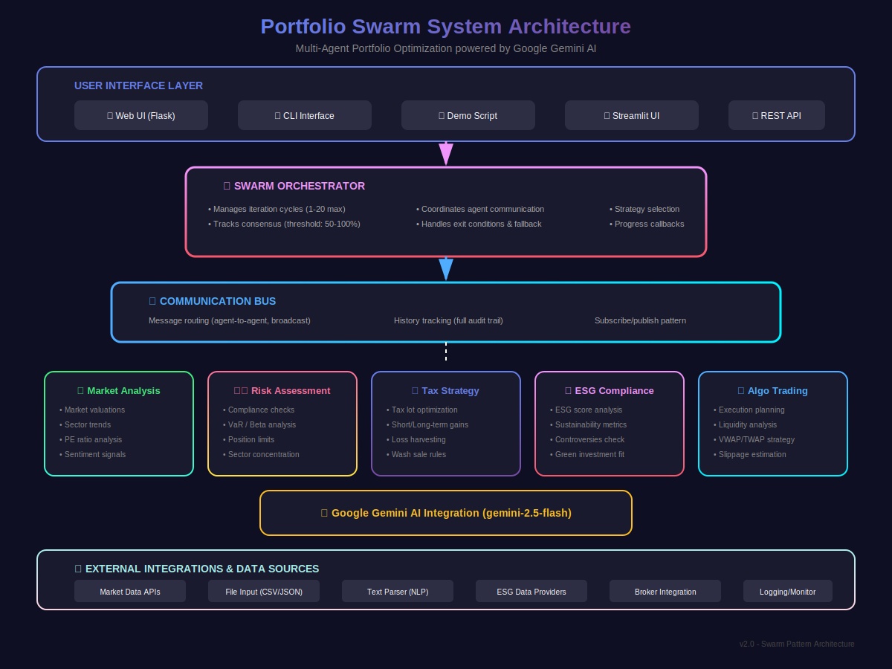
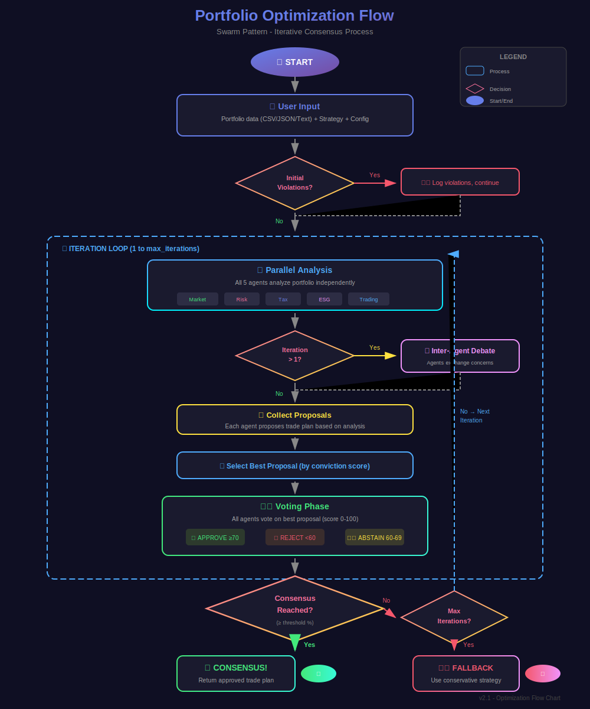
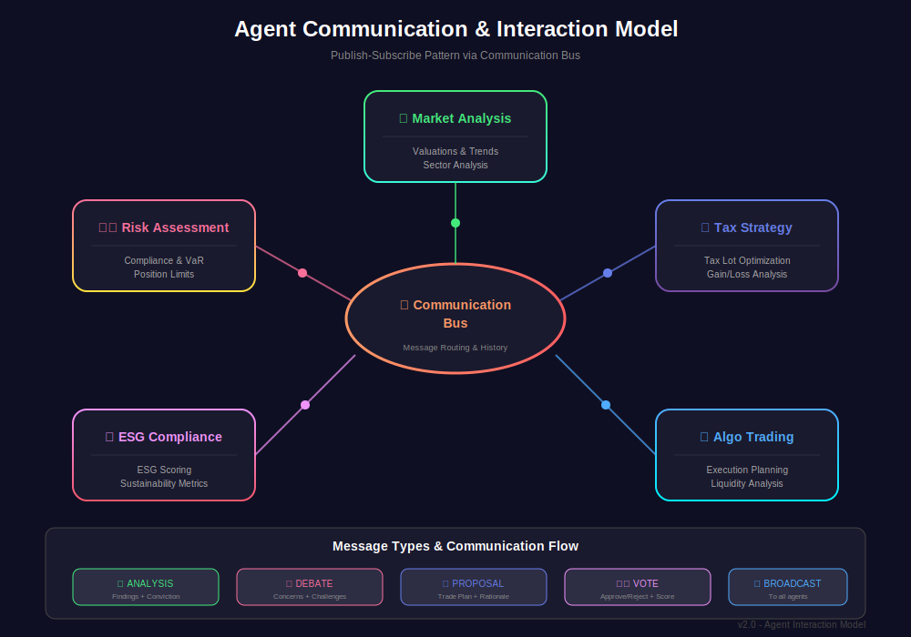
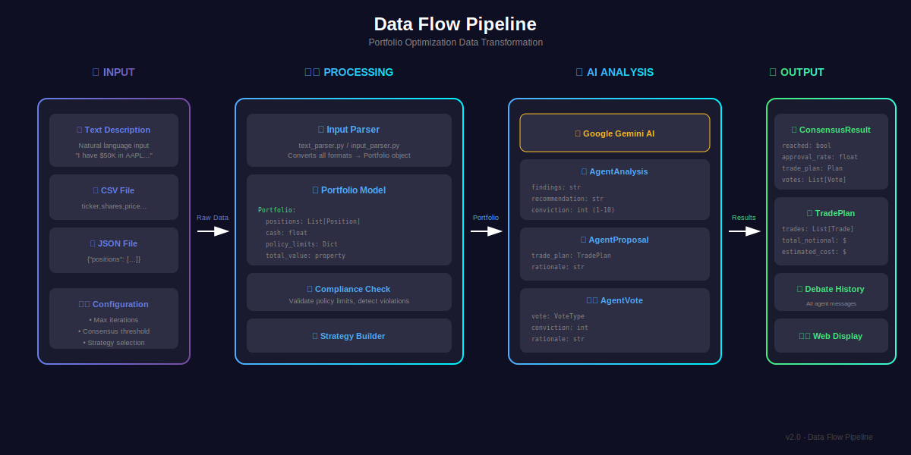
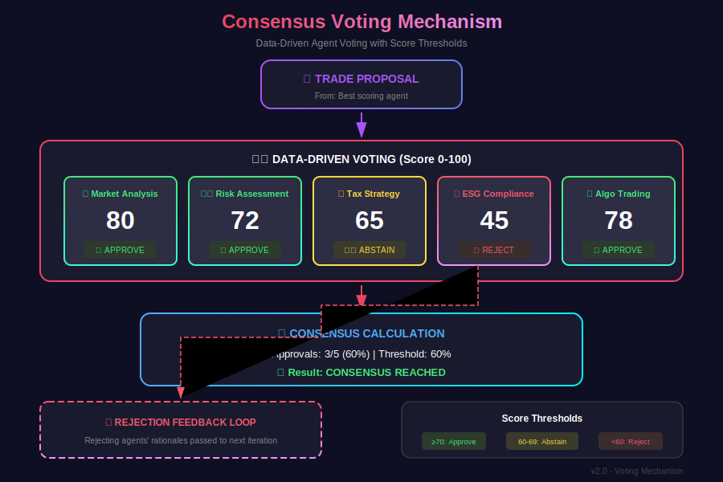
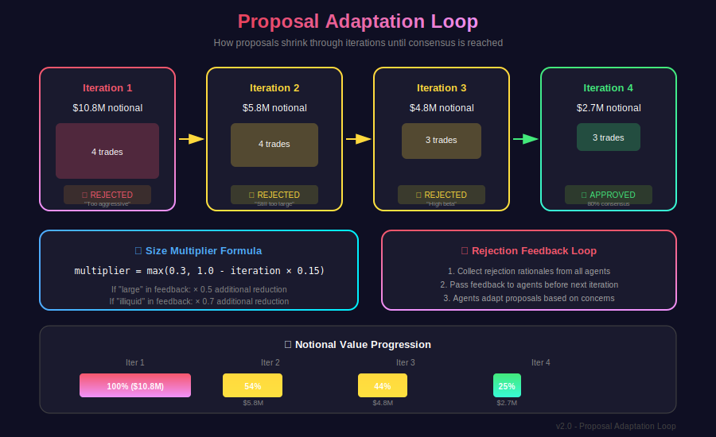

# Architecture Diagrams

This folder contains SVG diagrams illustrating the Portfolio Swarm system architecture and data flow.

## Available Diagrams

### 1. System Architecture (`architecture.svg`)


High-level view of the system layers:
- User Interface Layer (Web UI, CLI, REST API)
- Swarm Orchestrator
- Communication Bus
- 5 Specialized AI Agents
- External Integrations

### 2. Optimization Flow Chart (`flowchart.svg`)


Step-by-step visualization of the optimization process:
- Input handling
- Parallel analysis phase
- Inter-agent debate
- Proposal generation
- Voting & consensus
- Fallback handling

### 3. Agent Interaction Model (`agent-interaction.svg`)


Shows how agents communicate:
- Publish-subscribe pattern
- Message types (Analysis, Debate, Proposal, Vote)
- Communication bus architecture

### 4. Data Flow Pipeline (`data-flow.svg`)


Data transformation from input to output:
- Input formats (Text, CSV, JSON)
- Processing & parsing
- AI analysis
- Output models (ConsensusResult, TradePlan)

### 5. Voting Mechanism (`voting-mechanism.svg`)


Consensus voting visualization:
- Score-based voting (0-100)
- All 5 agent vote cards
- Threshold legend (Approve/Abstain/Reject)
- Rejection feedback loop
- Consensus calculation

### 6. Proposal Adaptation (`proposal-adaptation.svg`)


Iteration progression diagram:
- Shrinking proposal visualization
- Size multiplier formula
- Rejection feedback mechanism
- Notional value bar chart

## Usage

### In Markdown Documentation
```markdown

```

### In HTML
```html

```

### Direct Browser View
Open any `.svg` file directly in a web browser for interactive viewing.

## Diagram Standards

All diagrams follow these conventions:
- **Dark theme** background (#0f0f23)
- **Gradient color coding** for different components
- **Shadow effects** for visual depth
- **Consistent agent colors**:
  - Market Analysis: Green (#43e97b)
  - Risk Assessment: Pink/Orange (#fa709a)
  - Tax Strategy: Purple (#667eea)
  - ESG Compliance: Magenta (#f093fb)
  - Algo Trading: Blue (#4facfe)

## Editing Diagrams

These SVG files can be edited with:
- [Inkscape](https://inkscape.org/) (Free, open-source)
- [Figma](https://figma.com/)
- [draw.io](https://draw.io/)
- Any text editor (SVG is XML-based)

## Version

**Current Version**: 2.0  
**Last Updated**: February 2026
