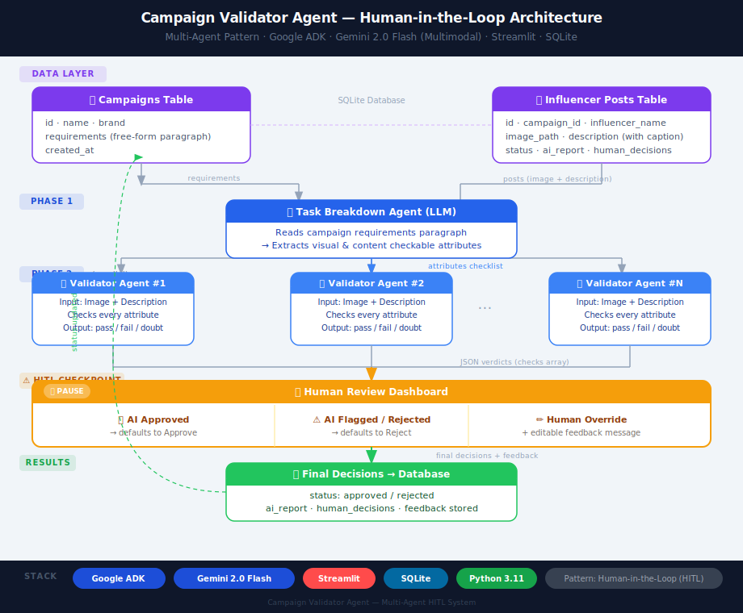
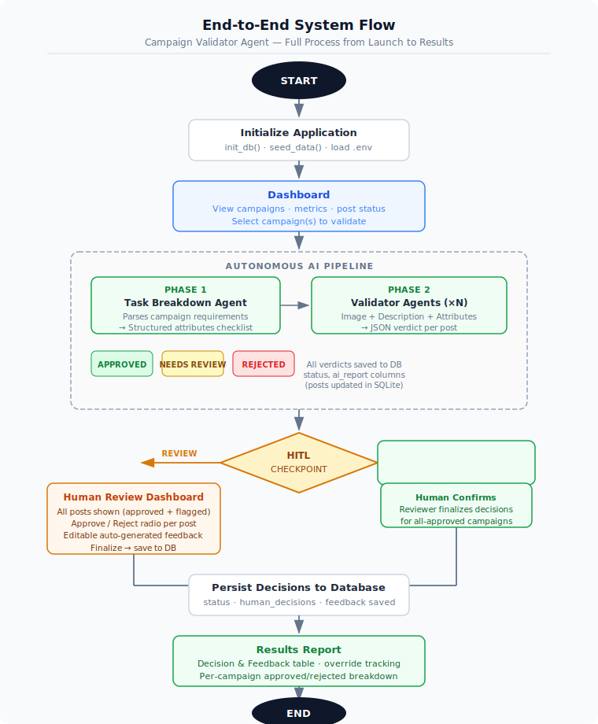
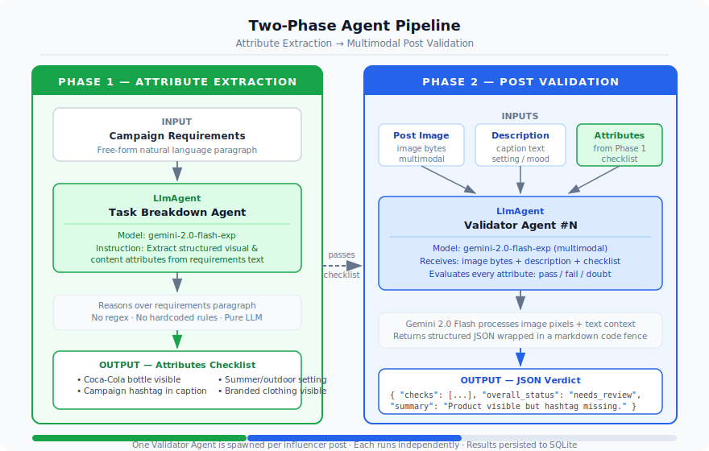
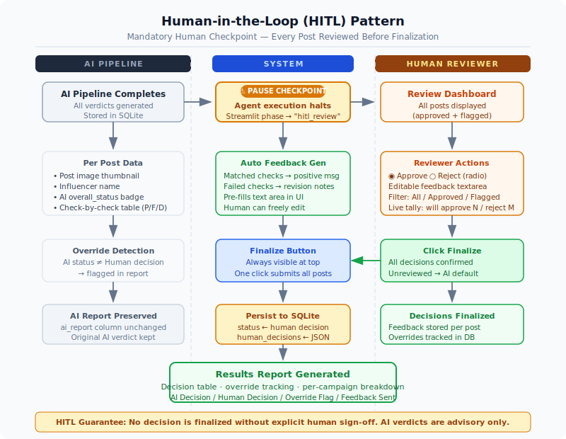

# Campaign Validator Agent

An autonomous AI agent system that validates influencer social media posts against brand campaign requirements using a **Human-in-the-Loop (HITL)** pattern. Built with Google ADK, Gemini 2.0 Flash (multimodal), and Streamlit.

---

## Table of Contents

1. [Project Overview](#project-overview)
2. [Architecture & Design Pattern](#architecture--design-pattern)
3. [System Flowcharts](#system-flowcharts)
4. [Component Deep Dive](#component-deep-dive)
5. [Database Schema](#database-schema)
6. [Agent Specifications](#agent-specifications)
7. [Implementation Details](#implementation-details)
8. [API & Class Reference](#api--class-reference)
9. [Frontend — Streamlit UI](#frontend--streamlit-ui)
10. [How to Run](#how-to-run)
11. [Tech Stack](#tech-stack)

---

## Project Overview

Brand campaigns rely on influencer posts being compliant with strict visual and content guidelines — correct product placement, required hashtags, branded clothing, setting, mood, and tone. Manual review at scale is slow, inconsistent, and costly.

This system automates the review pipeline end-to-end using a two-phase LLM agent workflow:

1. **Attribute Extraction** — An LLM agent reads the campaign requirements paragraph and extracts every independently-checkable attribute (no regex, no hardcoded rules).
2. **Post Validation** — A dedicated LLM agent per influencer post receives the image (multimodal), description, and attributes checklist, then returns a structured JSON verdict.

After the autonomous AI pipeline completes, the system pauses at a **mandatory HITL checkpoint**. A human reviewer confirms, overrides, or rejects every AI decision before anything is finalized. This ensures brand-safety decisions always have human sign-off.

### Supported Campaigns (Pre-loaded)

| Brand | Campaign | Posts |
|---|---|---|
| Coca-Cola | Summer Vibes 2026 | 2 |
| Nike | Just Move 2026 | 2 |
| L'Oréal Paris | Glow Up 2026 | 3 |

---

## Architecture & Design Pattern



The system is structured around three layers:

### Data Layer
SQLite stores all campaigns, influencer posts, AI reports, and human decisions. Two tables: `campaigns` (requirements, brand metadata) and `posts` (image path, description, status, AI report, human decisions).

### AI Pipeline Layer (Google ADK)
Two sequential `LlmAgent` types orchestrated by `InMemoryRunner`:

- **Task Breakdown Agent** — Reads campaign requirements once per campaign and extracts a structured attribute checklist.
- **Validator Agents** — One per influencer post; receives image bytes + description + checklist; returns a JSON verdict with per-attribute reasoning.

Both agents use **Gemini 2.0 Flash** with no tools, no regex, and no hardcoded rules — pure LLM reasoning.

### Frontend Layer (Streamlit)
A multi-page Streamlit app manages the four-phase workflow:
`Dashboard → Validating → HITL Review → Results`

Two additional pages: a Database Explorer and a Manage page for adding/editing campaigns and posts.

### Why HITL?

In brand safety contexts, false positives (approving a non-compliant post) and false negatives (rejecting a compliant post) both have direct business consequences. The HITL pattern inserts a mandatory human checkpoint after the AI pipeline, so:

- No decision is finalized without explicit human sign-off
- The reviewer sees **every** post — not just flagged ones — so they can also confirm AI approvals
- Overrides are tracked and surfaced in the Results report

---

## System Flowcharts

### 1 · System Architecture Overview


Full system overview: data flow from the SQLite database through the AI pipeline and into the Streamlit UI, showing how each technology layer connects.

### 2 · End-to-End Process Flow


Complete process flowchart from application start to results. Shows the HITL decision point — whether the reviewer confirms or overrides — and how all paths converge to the final database write and Results page.

### 3 · Two-Phase Agent Pipeline


Detail diagram of Phase 1 (Attribute Extraction) and Phase 2 (Post Validation). Shows inputs, agent internals, and outputs for each phase, and how the attributes checklist flows from Phase 1 into every Phase 2 validator agent.

### 4 · HITL Pattern Detail


Three-lane swimlane diagram (AI Pipeline · System · Human Reviewer) showing the HITL checkpoint in detail: the pause point, per-post reviewer actions, auto-feedback generation, override detection, and the finalize step that writes decisions to the database.

---

## Component Deep Dive

### `campaign_validator/agents.py`

The core of the AI pipeline. Contains two async functions called individually by `app.py` to enable step-by-step animated progress in the UI.

#### `extract_attributes(requirements, brand) → str`

Creates a fresh `LlmAgent` (AttributeExtractor) with a targeted instruction to parse the campaign requirements paragraph. The agent is instructed to output two groups:

- **VISUAL ATTRIBUTES** — checkable from the image (product visibility, branding, setting, mood)
- **CONTENT ATTRIBUTES** — checkable from the caption (mentions, hashtags, tone, authenticity)

The output is a clean numbered list, returned as a plain text string. No markdown fences, no preamble.

#### `validate_post(campaign_name, brand, attributes, influencer_name, description, image_path) → dict`

Creates a fresh `LlmAgent` (PostValidator_\<InfluencerName\>) per post. The instruction embeds the campaign name, brand, extracted attributes checklist, influencer name, and post description. The agent is instructed to be strict and cite exactly what it sees or does not see for each attribute.

If an image file exists at `images/<image_path>`, it is read as bytes and attached to the message as a `types.Part.from_bytes()` part — enabling Gemini 2.0 Flash multimodal vision.

Output is parsed from JSON (with code-fence stripping handled by `_strip_code_fences()`).

#### `validate_campaign_posts(campaign, posts) → list[dict]`

Convenience function that runs the full two-phase pipeline for a campaign. Called by `main.py` for CLI testing. `app.py` calls `extract_attributes` and `validate_post` individually for animated progress.

---

### `campaign_validator/database.py`

SQLite persistence layer. All functions open and close their own connection to avoid connection sharing across Streamlit reruns.

Key design choices:

- `PRAGMA journal_mode=WAL` for concurrent read safety
- `conn.row_factory = sqlite3.Row` so all results are dict-like
- `ai_report` and `human_decisions` stored as JSON strings, deserialized in `get_posts()`
- Reset functions (`reset_all_posts`, `reset_all_campaigns`) clear status, ai_report, and human_decisions so campaigns can be re-run

---

### `campaign_validator/schemas.py`

Pydantic v2 models for type-safe data handling:

- `CheckResult` — single attribute check with `attribute`, `status` (pass/fail/doubt), and `reasoning`
- `ValidationReport` — full AI verdict with `checks` list, `overall_status`, and `summary`
- `HumanDecision` — reviewer decision with `verdict` (approve/reject), `feedback` text, influencer name, and ISO timestamp

---

### `campaign_validator/config.py`

Single constant:
```python
GEMINI_MODEL = "gemini-2.0-flash"
```

Change this to switch the model for all agents.

---

### `app.py`

Main Streamlit application. Manages four phases using `st.session_state.phase`:

| Phase | Value | Description |
|---|---|---|
| Dashboard | `"dashboard"` | Campaign overview, run buttons |
| Validating | `"validating"` | Live animated agent pipeline |
| HITL Review | `"hitl_review"` | Human review dashboard |
| Results | `"results"` | Final decision report |

The `run_sync()` helper bridges async ADK agent calls into Streamlit's synchronous execution context. It detects a running event loop (Streamlit's internal loop) and uses a `ThreadPoolExecutor` to run `asyncio.run()` in a separate thread.

---

### `pages/1_Database.py`

Database Explorer page. Read-only view of all data in the database:

- Campaign summary table with post counts and status breakdowns
- Per-campaign tabs with per-post cards showing: image thumbnail, status badge, description, expandable AI report (checks table + raw JSON), expandable human decisions
- Raw data section with paginated tables for campaigns and posts

---

### `pages/2_Manage.py`

Manage Campaigns & Posts page. Four tabs:

| Tab | Purpose |
|---|---|
| ➕ New Campaign | Add a campaign with name, brand, and requirements paragraph |
| ➕ New Post | Add an influencer post — upload image or enter filename + write description |
| ✏️ Edit Campaign | Modify existing campaign name, brand, or requirements |
| 🗂️ Manage Posts | View all posts in a campaign, delete any post |

Image uploads are saved to the `images/` directory. Manual filenames assume the file is already placed there.

---

## Database Schema

### `campaigns` table

| Column | Type | Description |
|---|---|---|
| `id` | INTEGER PK | Auto-increment primary key |
| `name` | TEXT | Campaign name (e.g., "Coca-Cola Summer Vibes 2026") |
| `brand` | TEXT | Brand name (e.g., "Coca-Cola") |
| `requirements` | TEXT | Natural-language requirements paragraph |
| `created_at` | TEXT | SQLite datetime string |

### `posts` table

| Column | Type | Description |
|---|---|---|
| `id` | INTEGER PK | Auto-increment primary key |
| `campaign_id` | INTEGER FK | References `campaigns.id` |
| `influencer_name` | TEXT | Influencer display name |
| `image_path` | TEXT | Filename only — file lives in `images/` |
| `description` | TEXT | Natural-language paragraph describing the post and caption |
| `status` | TEXT | `pending` · `approved` · `rejected` · `needs_review` |
| `ai_report` | TEXT | JSON-serialized `ValidationReport` dict |
| `human_decisions` | TEXT | JSON-serialized list of `HumanDecision` dicts |
| `created_at` | TEXT | SQLite datetime string |

### Status Lifecycle

```
pending
  └── [AI pipeline runs]
        ├── approved      ← all checks pass
        └── needs_review  ← any fail or doubt
              └── [Human review]
                    ├── approved   ← human confirms or overrides
                    └── rejected   ← human rejects or confirms
```

---

## Agent Specifications

### Task Breakdown Agent

| Property | Value |
|---|---|
| ADK class | `LlmAgent` |
| Name | `AttributeExtractor` |
| Model | `gemini-2.0-flash` |
| Runner | `InMemoryRunner` (fresh per call) |
| Input | Campaign requirements paragraph (text only) |
| Output | Numbered list of VISUAL and CONTENT attributes |
| output_key | `extracted_attributes` |
| Tools | None (pure LLM reasoning) |

**Instruction summary:** Act as a campaign analyst for `{brand}`. Read the requirements paragraph and extract every independently-checkable attribute grouped into VISUAL and CONTENT categories. Output a clean numbered list only.

---

### Validator Agent

| Property | Value |
|---|---|
| ADK class | `LlmAgent` |
| Name | `PostValidator_{InfluencerName}` (one per post) |
| Model | `gemini-2.0-flash` |
| Runner | `InMemoryRunner` (fresh per call) |
| Input | Text: campaign + attributes + description; Image: JPEG/PNG bytes via `Part.from_bytes()` |
| Output | JSON with `checks`, `overall_status`, `summary` |
| output_key | `validation_result` |
| Tools | None (pure LLM multimodal reasoning) |

**Instruction summary:** Act as a compliance reviewer for `{brand}`. Examine the image and description. For each attribute in the checklist, determine `pass`, `fail`, or `doubt` with specific reasoning. Output ONLY valid JSON.

**JSON Output Schema:**
```json
{
  "checks": [
    {
      "attribute": "Coca-Cola bottle visible",
      "status": "pass",
      "reasoning": "Glass bottle clearly held in frame with logo readable"
    },
    {
      "attribute": "Campaign hashtag in caption",
      "status": "fail",
      "reasoning": "No #CocaColaSummer found in caption text"
    }
  ],
  "overall_status": "needs_review",
  "summary": "Post shows product prominently but is missing the required campaign hashtag."
}
```

**overall_status logic:**
- `approved` — ALL checks are `pass`
- `needs_review` — any check is `doubt`
- `rejected` — any check is `fail`

---

## Implementation Details

### Async Bridge (`run_sync`)

Streamlit runs in a synchronous context. Google ADK agents are async. The `run_sync()` helper detects whether a running event loop exists (Streamlit's own) and if so, uses a `ThreadPoolExecutor` to call `asyncio.run()` in a background thread — avoiding the "cannot run nested event loops" error.

```python
def run_sync(coro):
    try:
        loop = asyncio.get_event_loop()
        if loop.is_running():
            with concurrent.futures.ThreadPoolExecutor(max_workers=1) as pool:
                return pool.submit(asyncio.run, coro).result()
        return loop.run_until_complete(coro)
    except RuntimeError:
        return asyncio.run(coro)
```

### Code Fence Stripping

Gemini occasionally wraps JSON output in markdown code fences (` ```json ... ``` `). The `_strip_code_fences()` function in `agents.py` handles this by detecting the opening fence, collecting lines until the closing fence, and returning the inner content only.

### Feedback Pre-population

When the HITL review dashboard renders a post for the first time, it seeds `st.session_state[f"f_{post_id}"]` with a generated message before the `st.text_area` widget renders. This pattern lets Streamlit's widget pick up the default value while still being fully editable:

- **For AI-approved posts:** Positive message listing all matched attributes
- **For AI-flagged posts:** Action-required message listing failed/doubtful attributes, followed by matched attributes

### Session State Architecture

```python
st.session_state = {
    "phase": "dashboard" | "validating" | "hitl_review" | "results",
    "selected_campaign": int,            # active campaign ID
    "campaigns_to_validate": list[int],  # IDs queued for the AI run
    "hitl_posts": list[dict],            # post data + AI verdicts for HITL
    f"v_{post_id}": "approve" | "reject", # per-post verdict radio
    f"f_{post_id}": str,                 # per-post feedback text
}
```

### Image Handling

Images are stored as files in the `images/` directory. The `validate_post()` function checks file existence before reading bytes. MIME type is inferred from the file extension (`.jpg`/`.jpeg` → `image/jpeg`, `.png` → `image/png`). If no image file exists, the agent still runs on the text description alone.

---

## API & Class Reference

### `campaign_validator.agents`

```python
async def extract_attributes(requirements: str, brand: str) -> str | None
```
Runs the Task Breakdown Agent. Returns the extracted attributes as a plain text string, or `None` on failure.

```python
async def validate_post(
    campaign_name: str,
    brand: str,
    attributes: str,
    influencer_name: str,
    description: str,
    image_path: str | None,
) -> dict | None
```
Runs a Validator Agent for a single post. Returns the parsed JSON verdict dict, or `None` on failure.

```python
async def validate_campaign_posts(campaign: dict, posts: list[dict]) -> list[dict]
```
Full pipeline wrapper. Returns a list of `{"post_id": int, "report": dict, "attributes_used": str}`.

---

### `campaign_validator.database`

```python
def init_db() -> None                              # Create tables if not exist
def seed_data() -> None                            # Insert default campaigns/posts (idempotent)
def get_campaigns() -> list[dict]
def get_campaign(campaign_id: int) -> dict | None
def get_posts(campaign_id: int) -> list[dict]      # Deserializes ai_report + human_decisions JSON
def update_post_report(post_id: int, status: str, ai_report: dict) -> None
def save_human_decisions(post_id: int, decisions: list[dict], final_status: str) -> None
def reset_all_posts(campaign_id: int) -> None
def reset_all_campaigns() -> None
def add_campaign(name: str, brand: str, requirements: str) -> int
def update_campaign(campaign_id: int, name: str, brand: str, requirements: str) -> None
def add_post(campaign_id: int, influencer_name: str, image_path: str, description: str) -> int
def delete_post(post_id: int) -> None
```

---

### `campaign_validator.schemas`

```python
class CheckResult(BaseModel):
    attribute: str
    status: str          # "pass" | "fail" | "doubt"
    reasoning: str

class ValidationReport(BaseModel):
    checks: list[CheckResult]
    overall_status: str  # "approved" | "rejected" | "needs_review"
    summary: str

class HumanDecision(BaseModel):
    verdict: str         # "approve" | "reject"
    feedback: str
    influencer: str
    failed_checks: list[str]
    timestamp: str       # ISO 8601
```

---

## Frontend — Streamlit UI

### Main App (`app.py`) — 4 Phases

#### Phase 1 — Dashboard
Entry point. Shows all campaigns as cards with live metrics (total / approved / rejected / flagged / pending), a progress bar, and an expandable post list. Two action buttons:

- **Run Selected Campaign** — runs AI validation for pending posts in the active campaign
- **Run All Campaigns** — runs AI validation for all pending posts across all campaigns

A "Go to Human Review" shortcut appears if any posts are in `needs_review` state.

#### Phase 2 — Validating (Animated)
Live step-by-step progress using `st.status()`:

```
📊 Coca-Cola — Summer Vibes 2026
  🔍 Task Breakdown Agent — reading requirements...
  ✅ Task Breakdown Agent — identified 8 checkable attributes
  🔄 Validator Agents — launching 2 agents in sequence...
     🤖 Validator Agent #1 — analyzing Sarah Chen's post...
     ✅ Sarah Chen → APPROVED · 8/8 checks passed
     🤖 Validator Agent #2 — analyzing Mike Torres's post...
     ⚠️ Mike Torres → NEEDS_REVIEW · 2/8 checks passed
```

An overall progress bar counts posts processed across all campaigns.

#### Phase 3 — HITL Review Dashboard
Shows every post (AI-approved and AI-flagged) grouped by campaign. Per-post card includes:

- Influencer name + AI verdict badge
- AI summary sentence
- Image thumbnail
- Check-by-check grid (pass ✅ / fail ❌ / doubt ⚠️) with reasoning
- Expandable post description
- **Your Decision** radio: ✅ Approve / ❌ Reject (pre-set from AI verdict, overridable)
- **Message to influencer** — editable text area pre-populated with matched/unmatched check summary

Filter selectbox: All Posts / AI Approved only / AI Flagged only.

Live tally at bottom:
```
Will Approve: 5  ·  Will Reject: 2  ·  Your Overrides: 1
[✅ Finalize — Approve 5 · Reject 2]
```

The Finalize button saves all decisions to the database. Posts not visible in the current filter view default to the AI verdict.

#### Phase 4 — Results
Decision & Feedback Report table with columns:

| Influencer | Campaign | AI Decision | Human Decision | Override | Checks (P/F/D) | Feedback Sent |
|---|---|---|---|---|---|---|

Per-campaign tabs below show approved and rejected posts with images, check summaries, and feedback messages.

---

### Sidebar (All Phases)
- Active Campaign selector (dropdown)
- Global stats: Total / Approved / Rejected / Pending across all campaigns
- Reset Selected Campaign button
- Reset All Campaigns button

---

### Pages

#### Database Explorer (`pages/1_Database.py`)
Read-only database viewer:
- Campaign summary table
- Per-campaign tabs with expandable AI reports and human decisions
- Raw data tables for campaigns and posts

#### Manage (`pages/2_Manage.py`)
Four tabs for managing data:
- **New Campaign** — form with name, brand, requirements paragraph
- **New Post** — form with campaign selector, influencer name, image upload or filename, description
- **Edit Campaign** — pre-filled form to update existing campaign
- **Manage Posts** — view and delete posts per campaign

---

## How to Run

### 1. Install dependencies

```bash
pip install -r requirements.txt
```

### 2. Set API key

Create a `.env` file in the project root:
```
GOOGLE_API_KEY=your_gemini_api_key_here
```

Get a key at [Google AI Studio](https://aistudio.google.com/).

### 3. Add post images

Place influencer post images in the `images/` directory. On first run, the system writes an `images/IMAGE_DESCRIPTIONS.txt` file describing each image needed for the pre-loaded posts.

| File | Influencer | Campaign |
|---|---|---|
| `coke_sarah.jpg` | Sarah Chen | Coca-Cola Summer Vibes |
| `coke_mike.jpg` | Mike Torres | Coca-Cola Summer Vibes |
| `nike_emma.jpg` | Emma Rodriguez | Nike Just Move |
| `nike_jake.png` | Jake Williams | Nike Just Move |
| `loreal_priya.jpg` | Priya Patel | L'Oréal Paris Glow Up |
| `loreal_aisha.jpg` | Aisha Khan | L'Oréal Paris Glow Up |
| `loreal_lucas.jpg` | Lucas Chen | L'Oréal Paris Glow Up |

Images are optional — if a file does not exist the agent still validates using the description paragraph alone.

### 4. Run

```bash
streamlit run app.py
```

On Windows, if you encounter encoding issues with emoji output:

```bash
PYTHONIOENCODING=utf-8 python -m streamlit run app.py
```

### 5. Navigate the UI

```
Dashboard
   ├── Run Selected Campaign  ──┐
   └── Run All Campaigns  ──────┤
                                ▼
                        Validating (animated)
                        ├── 🔍 Task Breakdown Agent
                        └── 🤖 Validator Agents (#1...#N)
                                ▼
                        👤 Human Review Dashboard  ← HITL checkpoint
                        ├── All posts shown (approved + flagged)
                        ├── Approve / Reject radio per post
                        └── Editable feedback message
                                ▼
                        📊 Results
                        ├── Decision & Feedback Report table
                        └── Per-campaign approved/rejected breakdown
```

---

## Tech Stack

| Tool | Role |
|---|---|
| [Google ADK](https://google.github.io/adk-docs/) | Agent orchestration (`LlmAgent`, `InMemoryRunner`) |
| [Gemini 2.0 Flash](https://ai.google.dev/) | Multimodal LLM — image pixels + text reasoning |
| [Streamlit](https://streamlit.io/) | Multi-page web UI with session state |
| [SQLite](https://www.sqlite.org/) | Persistent storage — campaigns, posts, reports, decisions |
| [Pydantic v2](https://docs.pydantic.dev/) | Typed data validation schemas |
| [python-dotenv](https://pypi.org/project/python-dotenv/) | `.env` API key loading |
| Python 3.11+ | Runtime |

---

## Human-in-the-Loop Pattern

The HITL pattern inserts a mandatory human checkpoint into the autonomous workflow. As described in the [Google ADK documentation](https://google.github.io/adk-docs/):

> At a predefined checkpoint, the agent pauses its execution and calls an external system to wait for a person to review its work. This pattern lets a person approve a decision, correct an error, or provide necessary input before the agent can continue.

In this system:

- The AI pipeline runs fully autonomously (attribute extraction + post validation)
- It pauses after generating all verdicts — the Streamlit phase transitions from `"validating"` to `"hitl_review"` and the app waits for user interaction
- The human reviewer sees **every post** — not just failed ones — so they can confirm AI-approved posts too
- The reviewer can override any AI decision and customize the feedback message
- Only after clicking **Finalize** are decisions written to the database

This approach improves reliability for brand safety use cases where subjective judgment matters and false positives/negatives have real business consequences. Override tracking in the Results report also helps teams measure AI performance over time.

---

## Project Structure

```
campaign-validator-agent/
├── app.py                          # Main Streamlit app (4 phases)
├── pages/
│   ├── 1_Database.py               # Database explorer page
│   └── 2_Manage.py                 # Add/edit campaigns and posts
├── campaign_validator/
│   ├── agents.py                   # LLM agent pipeline
│   ├── database.py                 # SQLite helpers + seed data
│   ├── config.py                   # GEMINI_MODEL constant
│   └── schemas.py                  # Pydantic models
├── images/                         # Influencer post images
├── docs/
│   ├── architecture.svg            # System architecture overview
│   ├── end_to_end_flow.svg         # End-to-end process flowchart
│   ├── agent_pipeline.svg          # Two-phase agent pipeline detail
│   └── hitl_flow.svg               # HITL pattern swimlane diagram
├── requirements.txt
├── .env                            # GOOGLE_API_KEY (create manually)
└── README.md
```

---

## Methodology

| Concern | Approach |
|---|---|
| Attribute extraction | Pure LLM — no regex, no hardcoded rules |
| Image understanding | Gemini 2.0 Flash multimodal (image bytes + text) |
| Multi-post batching | Sequential validator agents, one per post |
| Async in Streamlit | ThreadPoolExecutor bridge for async ADK coroutines |
| HITL pattern | Pause after AI run; human reviews ALL posts |
| Feedback generation | Auto-generated from pass/fail checks; fully editable |
| Override tracking | Stored in DB; surfaced in Results report |
| Persistence | SQLite with WAL mode for concurrent access safety |
| New campaigns | Add via Manage page — no code changes required |
