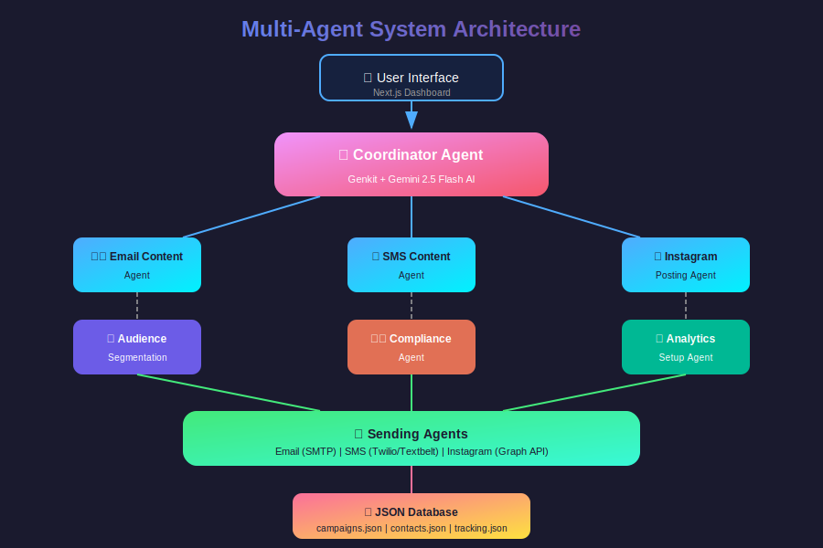
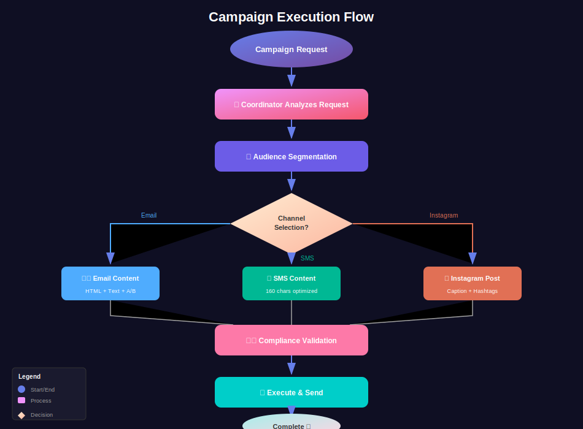
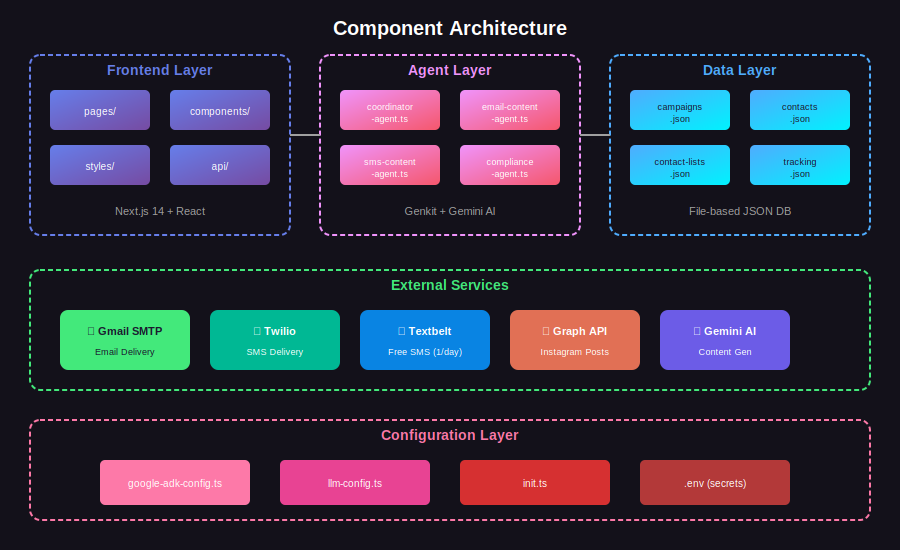
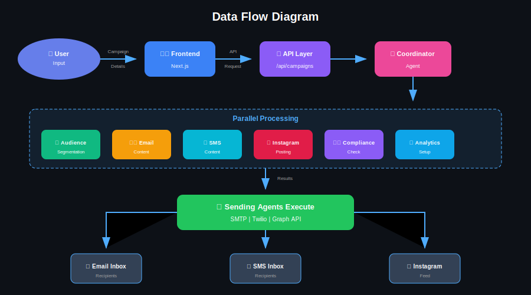
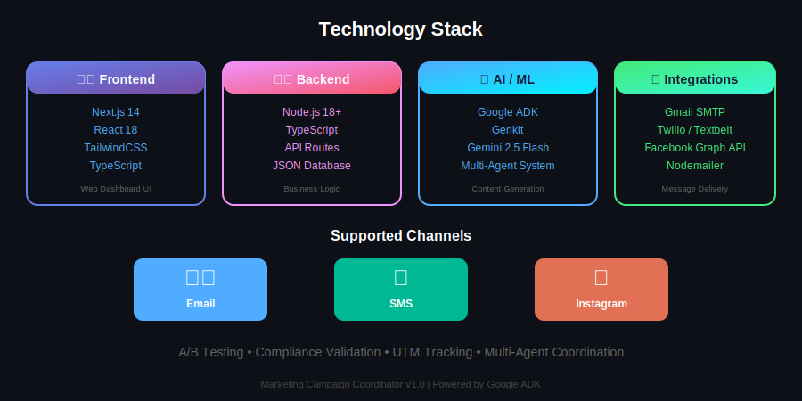
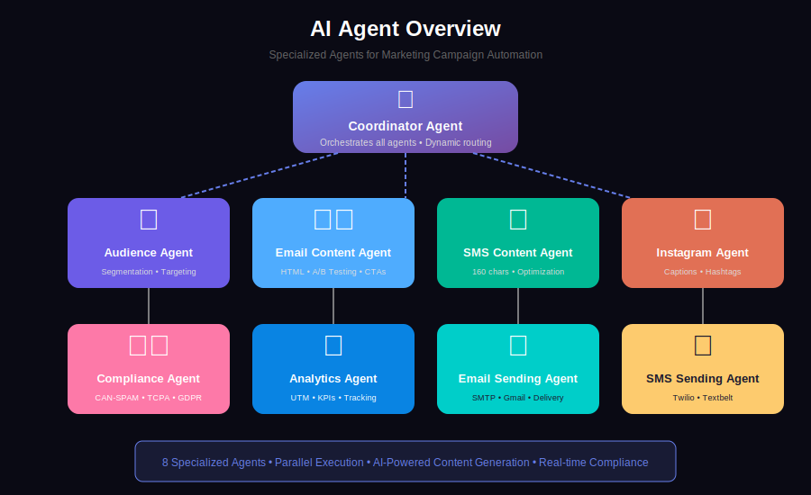

# Multi-Agent Marketing Campaign Coordinator
## Complete Project Documentation

---

## Table of Contents
1. [Project Overview](#project-overview)
2. [System Architecture](#system-architecture)
3. [Agent Flow Diagram](#agent-flow-diagram)
4. [Component Architecture](#component-architecture)
5. [Data Flow](#data-flow)
6. [Technology Stack](#technology-stack)
7. [AI Agents Overview](#ai-agents-overview)
8. [API Structure](#api-structure)
9. [Database Schema](#database-schema)
10. [Getting Started](#getting-started)

---

## Project Overview

This is a **Multi-Agent Marketing Campaign Automation System** built using the **Coordinator Pattern** powered by **Google ADK (Genkit)** with **Gemini 2.5 Flash**. The system orchestrates multiple specialized AI agents to plan, create, and execute multi-channel marketing campaigns across Email, SMS, and Instagram.

### Key Features
- **Dynamic Routing**: AI-powered coordinator determines which agents to invoke
- **Multi-Channel Support**: Email, SMS, and Instagram campaigns
- **Intelligent Agents**: Specialized agents for content, compliance, analytics
- **Real-time Tracking**: UTM parameters and conversion tracking
- **Compliance Built-in**: CAN-SPAM, TCPA, GDPR validation

---

## System Architecture

The following diagram shows the high-level system architecture:



---

## Agent Flow Diagram

This diagram illustrates the flow of data and control between agents during campaign execution:



---

## Component Architecture

This diagram shows the component structure and their relationships:



---

## Data Flow

This diagram illustrates how data flows through the system:



---

## Technology Stack



| Layer | Technology | Purpose |
|-------|-----------|---------|
| **Frontend** | Next.js 14, React, TailwindCSS | Web Dashboard UI |
| **Backend** | Node.js, TypeScript | API Routes & Business Logic |
| **AI/ML** | Google ADK (Genkit), Gemini 2.5 Flash | Content Generation & Decision Making |
| **Email** | Nodemailer, Gmail SMTP | Email Delivery |
| **SMS** | Twilio, Textbelt, Vonage, Plivo | SMS Delivery |
| **Social** | Facebook Graph API | Instagram Posting |
| **Database** | JSON Files | Data Persistence |
| **Styling** | TailwindCSS, CSS Modules | UI Styling |

---

## AI Agents Overview



---

## API Structure

### Campaign API Endpoints

| Method | Endpoint | Description |
|--------|----------|-------------|
| GET | `/api/campaigns` | List all campaigns |
| POST | `/api/campaigns` | Create new campaign |
| GET | `/api/campaigns/[id]` | Get campaign details |
| PUT | `/api/campaigns/update` | Update campaign |
| DELETE | `/api/campaigns/[id]` | Delete campaign |
| POST | `/api/campaigns/execute` | Execute campaign |
| POST | `/api/campaigns/resend` | Resend to recipients |
| POST | `/api/campaigns/schedule` | Schedule campaign |
| GET | `/api/campaigns/analytics` | Get analytics data |

### Contact API Endpoints

| Method | Endpoint | Description |
|--------|----------|-------------|
| GET | `/api/contacts` | List contacts (paginated) |
| POST | `/api/contacts` | Create contact |
| DELETE | `/api/contacts/[id]` | Delete contact |
| POST | `/api/contacts/upload-csv` | Bulk import from CSV |
| GET | `/api/contacts/lists` | Get contact lists |
| POST | `/api/contacts/lists` | Create contact list |

---

## Database Schema

### campaigns.json
```json
{
  "campaignId": "string",
  "campaignName": "string",
  "channels": ["email", "sms", "instagram"],
  "product": {
    "name": "string",
    "description": "string",
    "features": ["string"],
    "pricing": "string"
  },
  "targetAudience": {
    "demographics": "string",
    "interests": ["string"],
    "painPoints": ["string"]
  },
  "status": "draft | scheduled | executed | completed",
  "results": {
    "emailContent": {},
    "smsContent": {},
    "compliance": {},
    "analytics": {}
  }
}
```

### contacts.json
```json
{
  "id": "string",
  "firstName": "string",
  "lastName": "string",
  "email": "string",
  "phone": "string",
  "tags": ["string"],
  "optIn": {
    "email": true,
    "sms": true,
    "instagram": true
  },
  "createdAt": "ISO date",
  "updatedAt": "ISO date"
}
```

---

## Getting Started

### Prerequisites
- Node.js 18+
- Google AI API Key (for Gemini)
- Gmail account (for email sending)
- Optional: Twilio/Textbelt account (for SMS)
- Optional: Facebook Developer account (for Instagram)

### Installation

```bash
# Clone the repository
git clone <repository-url>
cd marketing-campaign

# Install dependencies
npm install

# Copy environment configuration
copy .env.example .env

# Add your API keys to .env file
# See SETUP-GUIDE.md for detailed configuration

# Start development server
npm run dev
```

### Environment Variables
```env
# AI Configuration
GOOGLE_AI_API_KEY=your_gemini_api_key

# Email Configuration
EMAIL_HOST=smtp.gmail.com
EMAIL_PORT=587
EMAIL_USER=your_email@gmail.com
EMAIL_PASS=your_app_password

# SMS Configuration (optional)
SMS_PROVIDER=textbelt
TWILIO_ACCOUNT_SID=your_sid
TWILIO_AUTH_TOKEN=your_token

# Instagram Configuration (optional)
INSTAGRAM_ACCESS_TOKEN=your_token
INSTAGRAM_ACCOUNT_ID=your_account_id
```

---

## License

MIT License - See LICENSE file for details.

---

*Documentation generated for Multi-Agent Marketing Campaign Coordinator v1.0*
