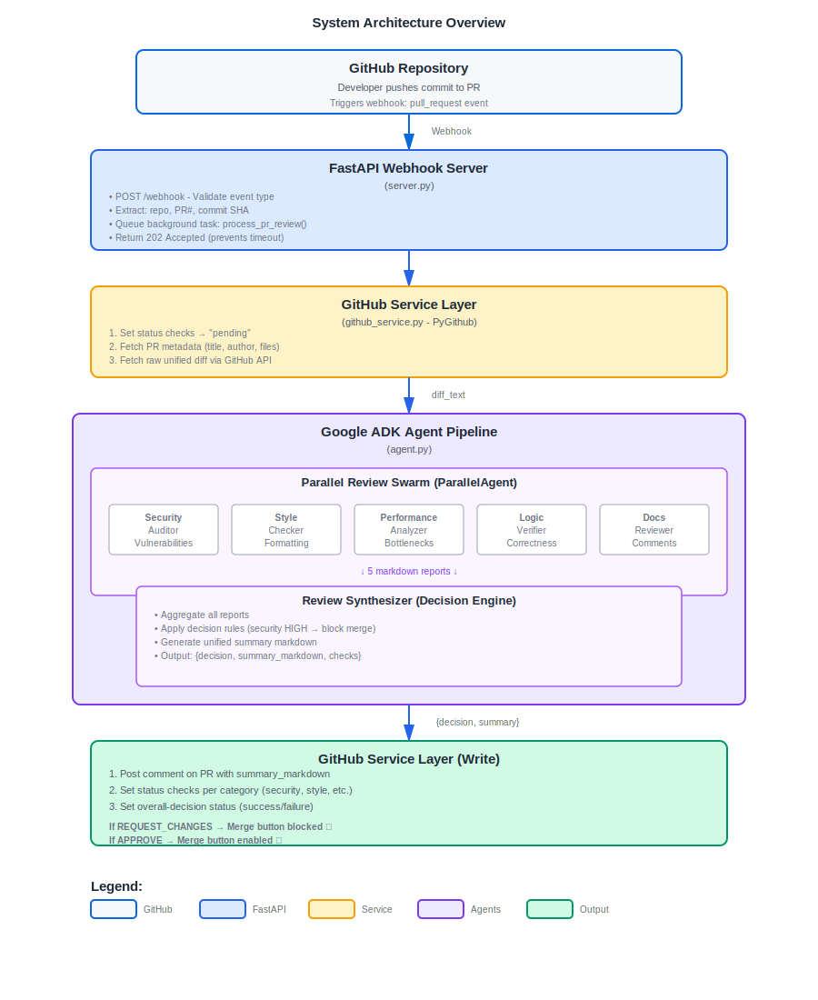
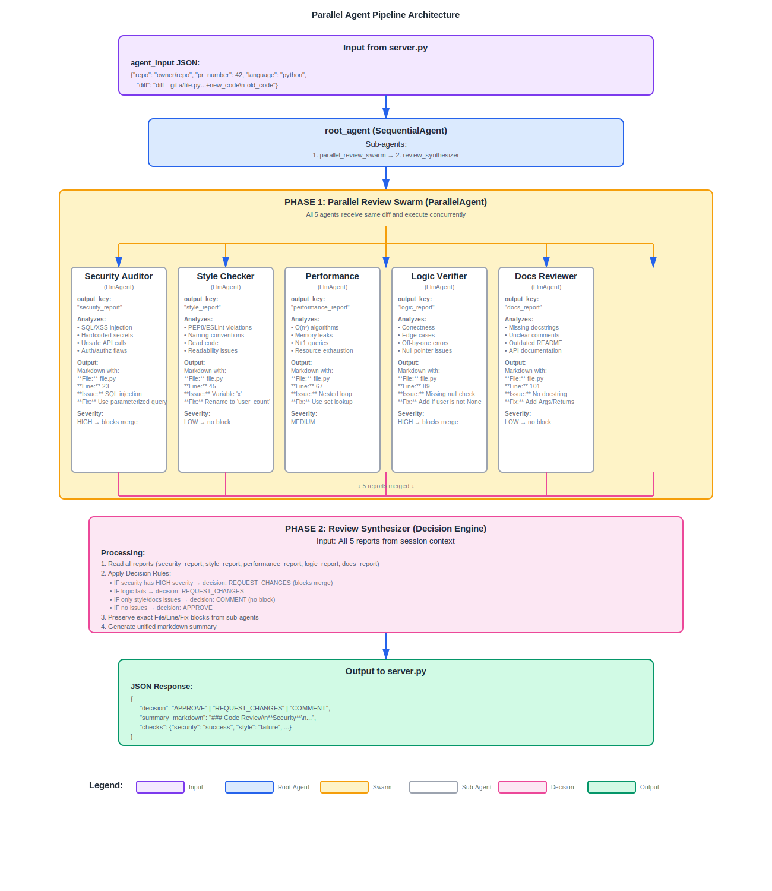
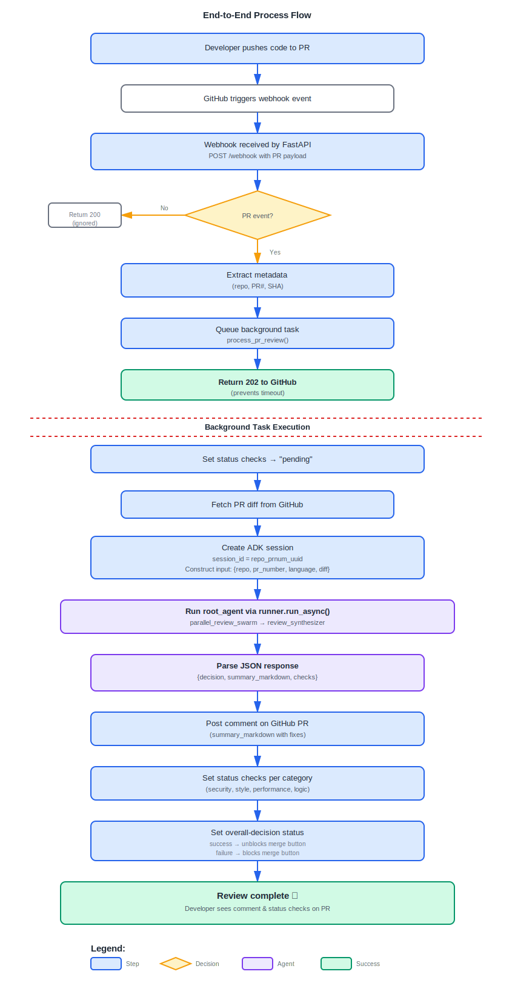

# PR Code Reviewer (GitHub Bot)

## 🟢 High-Level Overview
This agent acts as a Senior Lead Developer. It attaches itself to your GitHub repository and watches for new "Pull Requests" (code changes).

### What it does
When a developer submits code, this agent wakes up, reads the specific lines of code changed, and performs a 5-point inspection:
1. **Security**: Looks for hackers' backdoors or leaked passwords.
2. **Style**: Ensures the code looks professional (formatting).
3. **Performance**: Checks if the code will slow down the app.
4. **Logic**: Checks if the code actually does what it claims to do.
5. **Docs**: Checks if the code is explained/commented well.

**Result**: It posts a detailed comment on the PR and can block the merge if it finds security issues.

## ⚙️ Technical Deep Dive
**Architecture**: Event-Driven Parallel Swarm with Decision Engine.



### Event Listener (`server.py`)
- A FastAPI server listening for GitHub Webhooks (`pull_request` events).
- When GitHub pings the server, it triggers a `BackgroundTask` so GitHub doesn't time out.

### GitHub Service (`github_service.py`)
- A helper class using `PyGithub`. It authenticates using your `GITHUB_TOKEN`.
- It fetches the raw diff (the +/- lines of code) and updates status checks (the yellow/green circles on a PR) to "Pending".

### The Swarm (`agent.py`)
- **Input**: The raw diff string.
- **Processing**: The `ParallelAgent` sends this diff to 5 sub-agents (security, style, performance, logic, docs) simultaneously.
- **Specialized Output**: We forced these agents to output structured data: File | Line | Issue | Fix.



### The Synthesizer (Decision Engine)
- This is the brain. It waits for all 5 reports.
- It executes **Logic Rules**:
  - If Security == Fail → Decision: REQUEST_CHANGES (Block).
  - If Style == Fail → Decision: COMMENT (Don't Block).
- It compiles the specific feedback into a single Markdown summary.

### Action
- The `server.py` takes the final decision and posts it back to GitHub as a comment. It also marks the Status Checks as "Success" or "Failure" to physically enable/disable the "Merge" button.

### Complete Process Flow


## Setup & Running
1. Install dependencies:
   ```bash
   pip install -r requirements.txt
   ```
2. Set up environment variables in `.env`:
   ```env
   GOOGLE_API_KEY=your_key
   GITHUB_TOKEN=your_github_token
   GEMINI_MODEL=gemini-2.0-flash
   ```
3. Run the server:
   ```bash
   uvicorn server:app --reload
   ```
